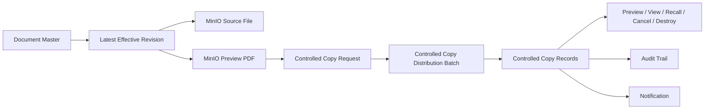
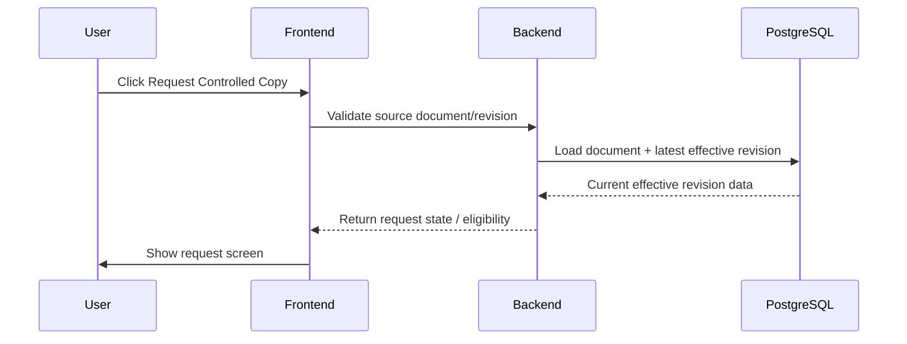
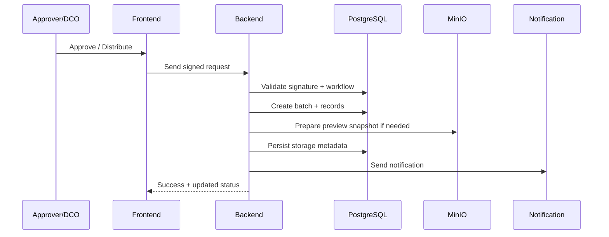
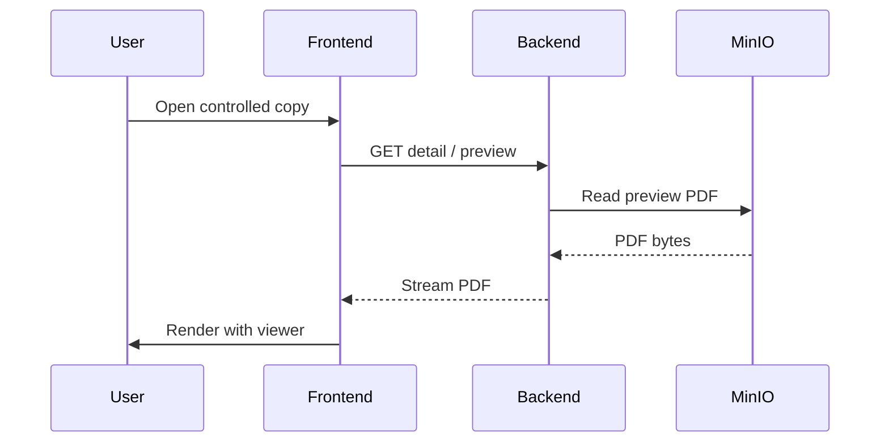
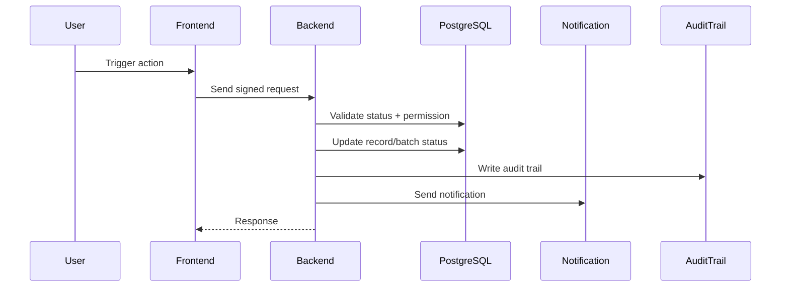

# Controlled Copies - Detailed Technical Design

Tài liệu này mô tả đặc tả kỹ thuật chi tiết cho module `controlled-copies`, dựa trên kiến trúc hiện có của module `documents` ở FE/BE và yêu cầu compliance EU-GMP.

Mục tiêu:

- Controlled Copy là lifecycle độc lập, nhưng vẫn bám theo `Document Master` và `Revision` hiện hành.
- MinIO là nơi lưu trữ chính thức của toàn bộ file nghiệp vụ.
- SharePoint chỉ dùng cho `Edit Online` như một workspace tạm.
- PostgreSQL chỉ lưu metadata, checksum, versionId và trạng thái.
- Audit Trail là bắt buộc cho mọi thao tác quan trọng.

---

## 1. Phạm Vi

### 1.1 FE

Các màn hình liên quan:

- `DocumentsView`
- `DetailDocumentView`
- `RevisionCreateView`
- `RevisionReviewView`
- `RevisionApprovalView`
- `RevisionTrainingView`
- `ControlledCopiesView`
- `ControlledCopyDetailView`
- `RequestControlledCopyView`
- `DestroyControlledCopyView`

### 1.2 BE

Các module liên quan:

- `DocumentController` / `DocumentService`
- `RevisionController` / `RevisionService`
- `ControlledCopyController` / `ControlledCopyService`
- `FileStorageService`
- `MinioObjectStorageService`
- `MicrosoftGraphOfficeOnlineService`
- `AuditTrailService`
- `EmailNotificationService`
- `SystemConfigurationService`

### 1.3 API

Nhóm API phải bao gồm:

- Document / Revision detail
- Controlled copy request / approve / distribute / recall / cancel / destroy
- Preview / evidence / signatures / audit trail
- Storage integration / preview settings / security config

### 1.4 DB

Các bảng/nhóm dữ liệu liên quan:

- `documents`
- `document_revisions`
- `controlled_copy_requests`
- `controlled_copy_distribution_batches`
- `controlled_copy_records`
- `controlled_copy_evidence_files`
- `audit_trail`
- `system_configuration`
- `file_storage_metadata` hoặc các cột metadata tương đương

---

## 2. Kiến Trúc Tổng Quan



### 2.1 Nguyên tắc

- Document Master và Revision là nơi quản lý nội dung tài liệu.
- Controlled Copy không sở hữu content gốc, chỉ sở hữu vòng đời bản sao.
- MinIO là source of truth của file.
- SharePoint chỉ phục vụ chỉnh sửa online tạm thời.
- Mọi file chính thức phải được sync ngược về MinIO.

---

## 3. Design FE / BE / API / DB

## 3.1 FE Design

### 3.1.1 Entry points tạo Controlled Copy

Được phép hiển thị nút `Request Controlled Copy` tại:

- `DocumentsView` khi document có latest effective revision hợp lệ
- `DetailDocumentView` khi document đang `Active` và latest revision là `Effective`
- `DetailRevisionView` khi revision đang `Effective` và document master đang `Active`

FE không được tự quyết định rule cuối cùng. Khi click, FE chỉ gửi request mở màn hình / tạo request-state, BE vẫn validate lại.

### 3.1.2 Request Controlled Copy screen

Màn `RequestControlledCopyView` cần support:

- Chọn distribution mode:
  - Internal
  - External
- Chọn distribution scope:
  - Business Unit
  - Department
  - Individual
- Hiển thị distribution list tương ứng
- Cho phép optional expiry date
- Cho phép note / comment / reason nếu business cần
- Hiển thị thông tin document/revision nguồn:
  - Document Number
  - Document Name
  - Revision Number
  - Revision Name
  - Effective Date
  - Valid Until

### 3.1.3 Controlled Copies list

`ControlledCopiesView` phải hỗ trợ:

- tab All Controlled Copies
- tab Ready for Distribution
- tab Distributed Copies
- batch row + expand row
- search / filter / pagination server-side
- action menu theo quyền và theo trạng thái

### 3.1.4 Controlled Copy detail

`ControlledCopyDetailView` phải hiển thị:

- batch detail hoặc record detail
- thông tin document/revision nguồn
- distribution information
- signatures
- audit trail
- evidence nếu có destroy / lost / damaged

### 3.1.5 Preview

FE phải tái sử dụng:

- `DocumentPdfViewer`
- `useDocumentPreviewSettings`

Các control download/print phải phụ thuộc vào cấu hình hệ thống:

- nếu `Allow Document Download or Print = false` thì ẩn download/print trên viewer
- nếu `true` thì hiển thị lại

### 3.1.6 State management / UX

FE cần:

- loading rõ ràng cho các action nặng
- optimistic UI chỉ áp dụng cho update nhỏ, không áp dụng cho workflow critical
- dùng server-side filter cho list lớn
- tránh gọi API lặp khi mở row expand / detail / audit

---

## 3.2 BE Design

### 3.2.1 Document / Revision as source

BE phải đảm bảo:

- controlled copy request luôn bám theo latest effective revision
- preview file luôn lấy từ MinIO preview snapshot
- source DOCX chỉ nằm ở revision storage
- không dùng SharePoint file ID làm source of truth

### 3.2.2 Controlled copy service responsibilities

`ControlledCopyService` chịu trách nhiệm:

- tạo request
- tạo batch
- tạo record theo từng recipient
- approve / distribute
- recall
- cancel
- destroy / report lost / damaged
- auto obsolete theo expiry hoặc theo trạng thái document/revision nguồn
- ghi audit trail
- gửi notification

### 3.2.3 Storage service responsibilities

`FileStorageService` + `MinioObjectStorageService` phải:

- lưu file chính thức vào MinIO
- attach checksum metadata
- mở file theo minio URI
- không cho delete hard trong MinIO nếu WORM retention đang bật
- hỗ trợ test connection

### 3.2.4 Microsoft Graph

`MicrosoftGraphOfficeOnlineService` chỉ dùng cho:

- Edit Online
- upload/edit working file tạm
- sync file đã sửa về MinIO
- convert source file sang PDF khi cần

Không dùng SharePoint làm file chính thức cuối cùng.

### 3.2.5 Audit service

`AuditTrailService` phải ghi:

- request
- approve
- distribute
- preview/view
- print/download nếu được phép
- recall / cancel / destroy
- expiry obsolete
- file sync / snapshot generated

---

## 3.3 API Design

### 3.3.1 Document / Revision

Các endpoint cần phục vụ controlled-copies:

- `GET /api/documents`
- `GET /api/documents/{id}`
- `GET /api/documents/{id}/detail`
- `GET /api/revisions/{id}`
- `GET /api/revisions/{id}/detail`
- `GET /api/revisions/{id}/resolved-detail`

BE phải trả sẵn:

- latest effective revision
- document status
- revision status
- signatures
- preview metadata
- storage metadata cần thiết cho controlled copy request

### 3.3.2 Controlled copy request / list / detail

Đề xuất API:

- `GET /api/controlled-copies/filters`
- `GET /api/controlled-copies`
- `GET /api/controlled-copies/batches`
- `GET /api/controlled-copies/batches/{batchId}`
- `GET /api/controlled-copies/batches/{batchId}/detail`
- `GET /api/controlled-copies/{id}`
- `GET /api/controlled-copies/{id}/detail`
- `GET /api/controlled-copies/{id}/resolved-detail`
- `GET /api/controlled-copies/{id}/preview`
- `GET /api/controlled-copies/{id}/preview/pages/{pageNumber}`

### 3.3.3 Workflow APIs

- `POST /api/controlled-copies`
- `POST /api/controlled-copies/{id}/approve`
- `POST /api/controlled-copies/{id}/distribute`
- `POST /api/controlled-copies/batches/{batchId}/distribute`
- `POST /api/controlled-copies/{id}/recall`
- `POST /api/controlled-copies/batches/{batchId}/recall`
- `POST /api/controlled-copies/{id}/cancel`
- `POST /api/controlled-copies/batches/{batchId}/cancel`
- `POST /api/controlled-copies/{id}/destroy`

### 3.3.4 Evidence APIs

- `GET /api/controlled-copies/{id}/evidence`
- `GET /api/controlled-copies/{id}/evidence/{evidenceId}/download`

### 3.3.5 Validation rules on API

API phải validate:

- controlled copy request chỉ tạo từ document/revision hợp lệ
- batch distribute chỉ chạy khi batch ở trạng thái hợp lệ
- single destroy chỉ chạy cho single record
- destroy không áp dụng cho batch
- expiry date hợp lệ nếu `hasExpiryDate = true`
- preview phải tồn tại trước khi release workflow sang review/approval

---

## 3.4 DB Design

### 3.4.1 Bảng controlled copy request

Lưu thông tin request gốc:

- `id`
- `document_id`
- `revision_id`
- `distribution_mode`
- `distribution_scope`
- `has_expiry_date`
- `expiry_date`
- `quantity`
- `status`
- `requested_by`
- `requested_at`
- `approved_by`
- `approved_at`
- `distributed_by`
- `distributed_at`
- `comment`
- `created_at`
- `created_by`
- `updated_at`
- `updated_by`

### 3.4.2 Bảng controlled copy distribution batch

Lưu batch summary:

- `id`
- `request_id`
- `document_id`
- `revision_id`
- `controlled_copy_number`
- `controlled_copy_name`
- `distribution_mode`
- `distribution_scope`
- `quantity`
- `ready_count`
- `distributed_count`
- `status`
- `distribution_list`
- `distribution_list_type`
- `distribution_list_value`
- `requested_by`
- `requested_at`
- `approved_by`
- `approved_at`
- `distributed_by`
- `distributed_at`

### 3.4.3 Bảng controlled copy record

Mỗi record:

- `id`
- `batch_id`
- `document_id`
- `revision_id`
- `copy_number`
- `controlled_copy_number`
- `controlled_copy_name`
- `recipient_user_id`
- `recipient_email`
- `distribution_list_type`
- `distribution_list_value`
- `status`
- `current_stage`
- `has_expiry_date`
- `expiry_date`
- `distributed_at`
- `distributed_by`
- `recall_date`
- `recall_by`
- `recall_reason`
- `destroyed_at`
- `destroyed_by`
- `destroy_reason`
- `destruction_type`
- `destruction_method`
- `witnessed_by`
- `created_at`
- `created_by`
- `updated_at`
- `updated_by`

### 3.4.4 Bảng evidence file

- `id`
- `controlled_copy_id`
- `file_name`
- `file_size`
- `content_type`
- `checksum`
- `minio_bucket`
- `minio_object_key`
- `minio_version_id`
- `uploaded_by`
- `uploaded_at`

### 3.4.5 Bảng storage metadata / mapping

Nếu hiện tại chưa có bảng riêng thì dùng cột có sẵn trong revision/document:

- `minio_bucket`
- `minio_object_key`
- `minio_version_id`
- `checksum`
- `file_name`
- `file_size`
- `content_type`
- `storage_provider`
- `storage_web_url`
- `storage_pdf_url`

---

## 4. Sequence Flow

## 4.1 Request Controlled Copy



### Business rules

- Document phải `Active`
- Latest revision phải `Effective`
- Nếu document/revision không hợp lệ thì chặn ngay

## 4.2 Approve and Distribute



## 4.3 View / Preview Controlled Copy



## 4.4 Recall / Cancel / Destroy



---

## 5. Data Model

## 5.1 Core enums

### Controlled copy status

- `READY_FOR_DISTRIBUTION`
- `DISTRIBUTED`
- `OBSOLETED`
- `CLOSED_CANCELLED`

### Distribution mode

- `INTERNAL`
- `EXTERNAL`

### Distribution scope

- `BUSINESS_UNIT`
- `DEPARTMENT`
- `INDIVIDUAL`

### Current stage

- `WAITING_FOR_QM`
- `READY_FOR_PRINT`
- `READY_FOR_DISTRIBUTION`
- `IN_USE`
- `DISTRIBUTED`
- `DESTROYED`
- `RECALLED`
- `CANCELLED`

## 5.2 Controlled Copy Record (logical shape)

```ts
type ControlledCopyRecord = {
  id: string;
  batchId?: string;
  documentId: string;
  revisionId: string;
  controlledCopyNumber: string;
  controlledCopyName: string;
  copyNumber: number;
  status: "READY_FOR_DISTRIBUTION" | "DISTRIBUTED" | "OBSOLETED" | "CLOSED_CANCELLED";
  distributionMode: "INTERNAL" | "EXTERNAL";
  distributionScope: "BUSINESS_UNIT" | "DEPARTMENT" | "INDIVIDUAL";
  distributionListType?: string;
  distributionListValue?: string;
  recipientUserId?: string;
  recipientEmail?: string;
  hasExpiryDate: boolean;
  expiryDate?: string | null;
  distributedAt?: string | null;
  recalledAt?: string | null;
  recallReason?: string | null;
  destroyedAt?: string | null;
  destroyReason?: string | null;
  destructionType?: string | null;
  destructionMethod?: string | null;
  witnessedBy?: string | null;
  minioBucket?: string;
  minioObjectKey?: string;
  minioVersionId?: string;
  checksum?: string;
};
```

## 5.3 Batch summary

```ts
type ControlledCopyBatch = {
  id: string;
  requestId?: string;
  documentId: string;
  revisionId: string;
  controlledCopyNumber: string;
  controlledCopyName: string;
  quantity: number;
  readyCount: number;
  distributedCount: number;
  status: string;
  distributionMode: string;
  distributionScope: string;
  distributionList?: string;
  distributionListType?: string;
  distributionListValue?: string;
  copyIds: string[];
};
```

---

## 6. Storage Design / MinIO

### 6.1 Naming convention

- Revision source file:
  - `revisions/{revisionId}/source/{fileName}`
- Revision preview PDF:
  - `revisions/{revisionId}/preview.pdf`
- Controlled copy preview PDF:
  - `controlled-copies/{controlledCopyId}/preview.pdf`
- Controlled copy evidence:
  - `controlled-copies/{controlledCopyId}/evidence/{uuid}_{fileName}`

### 6.2 Required rules

- Object lock: `COMPLIANCE`
- Bucket versioning: `enabled`
- Checksum: SHA-256 persisted in DB and MinIO user metadata
- No hard delete trên object chính thức
- Deletion chỉ là logical state nếu nghiệp vụ cho phép

### 6.3 Edit Online rule

Luồng chuẩn:

1. MinIO source file
2. Upload tạm sang SharePoint
3. Open Word Online
4. User edit
5. Save/Close
6. Download file mới từ SharePoint
7. Sync ngược về MinIO
8. Update checksum + metadata trong DB
9. Xóa/archive file tạm trên SharePoint

---

## 7. API Detail Suggestion

## 7.1 Controlled copy creation

### Request payload

```json
{
  "documentId": "uuid",
  "revisionId": "uuid",
  "distributionMode": "INTERNAL",
  "distributionScope": "DEPARTMENT",
  "distributionList": ["uuid-or-email"],
  "quantity": 10,
  "hasExpiryDate": true,
  "expiryDate": "2026-06-24T10:00:00+07:00",
  "comment": "Optional note"
}
```

### Validation

- `documentId` and `revisionId` must match latest effective source
- `hasExpiryDate = true` requires `expiryDate`
- `expiryDate >= distributionDate`
- distribution list cannot be empty

## 7.2 Distribution

Batch distribute endpoint should:

- create controlled copy records
- resolve recipient mapping
- generate controlled copy number
- update status to `Distributed`
- record audit trail
- send notification

## 7.3 Preview

- `GET /controlled-copies/{id}/preview`
- `GET /controlled-copies/{id}/preview/pages/{pageNumber}`

Response must come from backend stream, not direct MinIO public URL.

## 7.4 Destroy / lost / damaged

Must require:

- e-signature
- reason
- destruction type
- witness if required
- evidence file if available

Must set status to `Obsoleted`, not `Closed - Cancelled`.

## 7.5 Recall / cancel

- `Recall Immediately` and `Cancel Distribution` must support both:
  - batch
  - single record
- Backend must distinguish action target clearly
- Audit trail must include target type and reason

---

## 8. Sequence Flow chi tiết theo action

## 8.1 Request Controlled Copy

1. User chọn `Request Controlled Copy`
2. FE mở form request
3. FE load document/revision source data từ BE
4. FE hiển thị distribution options
5. User submit
6. BE validate:
   - document active
   - revision effective
   - latest revision mapping
7. BE tạo batch/request
8. BE trả kết quả

## 8.2 Approve / Distribute

1. User ký điện tử
2. BE verify signature
3. BE generate controlled copy records
4. BE resolve recipient list
5. BE persist records
6. BE update batch status
7. BE ghi audit trail
8. BE send notification email
9. FE refresh list/detail

## 8.3 View / Preview

1. User mở detail hoặc expand row
2. FE gọi detail API
3. BE load record + preview metadata
4. BE stream PDF từ MinIO
5. FE render PDF viewer
6. FE áp dụng security settings cho download/print

## 8.4 Destroy / Report Lost-Damaged

1. User chọn action trên single controlled copy record
2. FE mở modal destruction type selection
3. User nhập reason + ký điện tử
4. BE verify e-signature
5. BE lưu evidence files vào MinIO
6. BE update status = `OBSOLETED`
7. BE ghi audit trail chi tiết
8. BE gửi notification

## 8.5 Expiry obsolete

1. Scheduler chạy hằng ngày
2. BE query records `Distributed` có `hasExpiryDate = true`
3. So sánh `currentDate >= expiryDate`
4. Update status = `OBSOLETED`
5. Ghi audit trail
6. Gửi notification

Nếu document/revision nguồn bị `Obsoleted`, toàn bộ controlled copies đang `Distributed` cũng phải tự chuyển `Obsoleted`.

---

## 9. Acceptance Criteria

### 9.1 FE

- Controlled Copy request chỉ hiển thị khi document/revision hợp lệ.
- Batch và record được phân biệt rõ ràng.
- Distribution List hiển thị đúng theo:
  - Internal + Business Unit / Department = tên đơn vị
  - Internal + Individual = tên user ở record
  - External = email ở record
- Preview dùng PDF viewer chung.
- Download/print ẩn theo config hệ thống.
- Report Lost/Damaged chỉ mở cho single record.

### 9.2 BE

- Request Controlled Copy luôn validate lại rule nguồn.
- Distribute tạo record theo batch đúng số lượng.
- Recall / Cancel hỗ trợ batch và single record.
- Destroy / lost / damaged chỉ hỗ trợ single record.
- Status controlled copies chỉ còn 4 trạng thái:
  - Ready for Distribution
  - Distributed
  - Obsoleted
  - Closed - Cancelled
- Hết hạn phải chuyển `Obsoleted`, không chuyển `Closed - Cancelled`.
- Document/Revision obsolete phải kéo theo controlled copies distributed.

### 9.3 API

- API list/detail hỗ trợ filter/search/pagination server-side.
- Preview API stream từ backend.
- Action APIs trả lỗi rõ ràng nếu target không hợp lệ.
- API batch và single record phải phân biệt rõ.
- API audit trail phải trả đủ reason / signature / metadata.

### 9.4 DB

- Lưu đủ metadata cho batch, record, storage, evidence, audit.
- Có checksum / bucket / objectKey / versionId.
- Không lưu SharePoint như source of truth.
- Không hard delete object chính thức trong MinIO.

---

## 10. Kết Luận

Thiết kế phù hợp nhất cho `controlled-copies` là:

- `Document / Revision` giữ nội dung chính thức
- `Controlled Copy` giữ vòng đời phân phối và tracking
- `MinIO` giữ toàn bộ file chính thức
- `SharePoint` chỉ là workspace tạm cho Edit Online
- `Audit Trail` và `Notification` là bắt buộc

Nếu cần, bước tiếp theo có thể làm:

1. Chuyển bản đặc tả này thành checklist triển khai FE/BE/API/DB.
2. Bắt đầu code thực tế cho từng màn `controlled-copies`.
