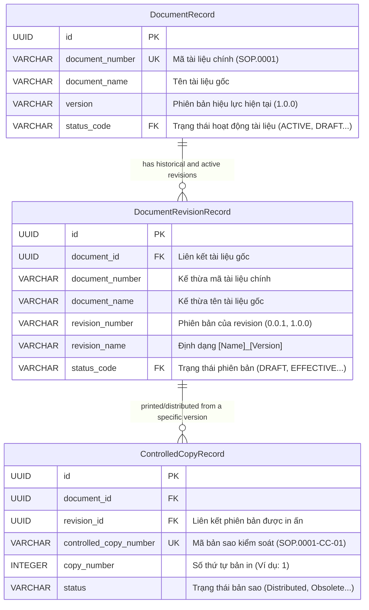

# Cấu trúc Thiết kế & Quy định: Mã số, Version, Tên trong Module Documents

Tài liệu này làm rõ cách hệ thống EDMS (Electronic Document Management System) thiết kế, lưu trữ và đồng bộ hóa các khái niệm **Mã số (Code/Number)**, **Phiên bản (Version/Revision)**, và **Tên gọi (Name/Title)** qua 4 tầng: **Database (PostgreSQL)**, **Server (Spring Boot Java/JPA)**, **API Rest**, và **Frontend (React/TypeScript)**.

---

## 1. Sơ đồ Quan hệ Thực thể (Model Relationships)

Hệ thống quản lý tài liệu chia làm 3 thực thể chính để đảm bảo khả năng lưu vết lịch sử (Audit Trail) và quy trình kiểm soát bản in (Controlled Copy):



---

## 2. Thiết kế Cơ sở Dữ liệu Chi tiết (Database Schema Design)

Dữ liệu được lưu trữ trong cơ sở dữ liệu PostgreSQL thông qua các liên kết khóa ngoại (Foreign Keys - FK) để đảm bảo tính toàn vẹn dữ liệu khi thay đổi trạng thái hoặc xóa tài liệu.

### 2.1. Cấu trúc bảng tài liệu chính (`documents`)
Lưu giữ hồ sơ gốc của tài liệu. Bảng này giữ giá trị phiên bản và trạng thái đang có hiệu lực hoạt động.

| Tên cột | Kiểu dữ liệu | Ràng buộc | Ý nghĩa / Quy định |
| :--- | :--- | :--- | :--- |
| `id` | `UUID` | `PRIMARY KEY` | Định danh hệ thống duy nhất của tài liệu. |
| `document_number` | `VARCHAR(80)` | `UNIQUE`, `NOT NULL` | Mã số tài liệu sinh tự động theo định dạng `[Loại tài liệu].[Số thứ tự]` (ví dụ: `SOP.0001`). Không thay đổi trong vòng đời. |
| `document_name` | `VARCHAR(255)` | `NOT NULL` | Tiêu đề chính thức của tài liệu do người soạn thảo đặt. |
| `version` | `VARCHAR(40)` | `NOT NULL` | Phiên bản hoạt động hiện tại (ví dụ: `1.0.0` nếu đã xuất bản, hoặc `0.0.1` khi đang là nháp). |
| `status_code` | `VARCHAR(40)` | `FOREIGN KEY` | Khóa ngoại liên kết bảng `document_status_definitions` (mã trạng thái hoạt động: `DRAFT`, `ACTIVE`, `OBSOLETED`). |

### 2.2. Cấu trúc bảng phiên bản (`document_revisions`)
Lưu lịch sử tất cả các phiên bản (Drafts, In-Review, Effective, Superseded) của từng tài liệu.

| Tên cột | Kiểu dữ liệu | Ràng buộc | Ý nghĩa / Quy định |
| :--- | :--- | :--- | :--- |
| `id` | `UUID` | `PRIMARY KEY` | Định danh duy nhất cho bản sửa đổi cụ thể này. |
| `document_id` | `UUID` | `FOREIGN KEY`, `NOT NULL` | Liên kết ngược lại tài liệu gốc ở bảng `documents`. Khi xóa tài liệu chính sẽ xóa cascade tất cả revisions. |
| `document_number` | `VARCHAR(80)` | `NOT NULL` | Lưu thừa dữ liệu (redundancy) từ tài liệu chính để tăng tốc độ truy vấn tìm kiếm mà không cần JOIN bảng. |
| `document_name` | `VARCHAR(255)` | `NOT NULL` | Lưu tiêu đề tài liệu tại thời điểm tạo revision. |
| `revision_number` | `VARCHAR(40)` | `NOT NULL` | Số hiệu phiên bản cụ thể (ví dụ: `0.0.1`, `0.0.2` khi đang sửa đổi hoặc `1.0.0` khi phát hành). |
| `revision_name` | `VARCHAR(255)` | `NOT NULL` | Lưu tên vật lý của phiên bản theo công thức `[document_name]_[revision_number]` (tiện cho việc đặt tên file xuất bản). |
| `status_code` | `VARCHAR(40)` | `FOREIGN KEY` | Khóa ngoại liên kết trạng thái phiên bản (ví dụ: `DRAFT`, `IN_REVIEW`, `EFFECTIVE`, `SUPERSEDED`, `OBSOLETE`, `CANCELLED`). |

### 2.3. Cấu trúc bảng bản sao kiểm soát (`controlled_copies`)
Lưu vết in ấn và phát hành bản giấy của tài liệu đến các phòng ban.

| Tên cột | Kiểu dữ liệu | Ràng buộc | Ý nghĩa / Quy định |
| :--- | :--- | :--- | :--- |
| `id` | `UUID` | `PRIMARY KEY` | Định danh bản sao kiểm soát. |
| `document_id` | `UUID` | `FOREIGN KEY`, `NOT NULL` | Liên kết với tài liệu chính. |
| `revision_id` | `UUID` | `FOREIGN KEY`, `NOT NULL` | Liên kết với **chính xác phiên bản** được in ra (chỉ in được từ phiên bản có trạng thái `EFFECTIVE`). |
| `controlled_copy_number` | `VARCHAR(100)` | `UNIQUE`, `NOT NULL` | Sinh tự động dạng `[document_number]-CC-[copy_number]` (ví dụ: `SOP.0001-CC-01`). |
| `copy_number` | `INT` | `NOT NULL` | Số thứ tự bản sao được phát hành (bắt đầu từ 1). |
| `status` | `VARCHAR(40)` | `NOT NULL` | Trạng thái của bản in (ví dụ: `Requested`, `Printed`, `Distributed`, `Recalled`, `Obsolete`). |

### 2.4. Mã DDL minh họa cấu trúc Schema
```sql
-- Định nghĩa bảng tài liệu chính
CREATE TABLE documents (
    id UUID PRIMARY KEY,
    document_number VARCHAR(80) UNIQUE NOT NULL,
    document_name VARCHAR(255) NOT NULL,
    version VARCHAR(40) NOT NULL,
    status_code VARCHAR(40) NOT NULL REFERENCES document_status_definitions(code)
);

-- Định nghĩa bảng các phiên bản tài liệu
CREATE TABLE document_revisions (
    id UUID PRIMARY KEY,
    document_id UUID NOT NULL REFERENCES documents(id) ON DELETE CASCADE,
    document_number VARCHAR(80) NOT NULL,
    document_name VARCHAR(255) NOT NULL,
    revision_number VARCHAR(40) NOT NULL,
    revision_name VARCHAR(255) NOT NULL,
    status_code VARCHAR(40) NOT NULL REFERENCES revision_status_definitions(code)
);

-- Định nghĩa bảng bản sao kiểm soát
CREATE TABLE controlled_copies (
    id UUID PRIMARY KEY,
    document_id UUID NOT NULL REFERENCES documents(id) ON DELETE CASCADE,
    revision_id UUID NOT NULL REFERENCES document_revisions(id) ON DELETE CASCADE,
    controlled_copy_number VARCHAR(100) UNIQUE NOT NULL,
    copy_number INT NOT NULL,
    status VARCHAR(40) NOT NULL
);
```

---

## 3. Quy định về Mã số (Document Code / Number)

### 3.1. Mã số Tài liệu chính (`documentNumber`)
- **Định dạng**: `[SHORTCODE].[SEQUENCE]` (Ví dụ: `SOP.0001`, `POL.0002`).
- **Quy tắc sinh tự động**:
  - Khi tạo một bản thảo tài liệu mới (`createDocumentDraft`), Server sẽ đọc mã viết tắt của loại tài liệu (`DocumentType.shortCode` ví dụ: `SOP`, `POL`, `WI`, `QM`).
  - Hệ sinh số thứ tự tự động tăng cho loại tài liệu đó trong Database, đệm thêm chữ số 0 để đủ 4 chữ số (`%04d`).
  - Số hiệu này là **duy nhất** (`unique = true`) và **không thay đổi** suốt vòng đời của tài liệu.

### 3.2. Mã đối tượng Phiên bản (Revision Object Code)
- Để phân biệt các phiên bản khác nhau trong danh sách hoặc trong log, hệ thống sinh mã hiển thị:
  - **Định dạng**: `[documentNumber] Rev.[revisionNumber]` (Ví dụ: `SOP.0001 Rev.1.0.0`).

### 3.3. Mã số Bản sao Kiểm soát (`controlledCopyNumber`)
- Khi người dùng yêu cầu in hoặc phân phát một tài liệu hiệu lực (Effective), hệ thống sẽ cấp một Mã bản sao kiểm soát duy nhất.
  - **Định dạng**: `[documentNumber]-CC-[copyNumber]` (Ví dụ: `SOP.0001-CC-01`).

---

## 4. Quy định về Phiên bản (Version / Revision Number)

Hệ thống áp dụng chuẩn **Semantic Versioning** (`Major.Minor.Patch` - ví dụ: `0.0.1`, `1.0.0`) và quản lý tăng phiên bản chặt chẽ theo trạng thái vòng đời.

### 4.1. Các thuật toán biến đổi Phiên bản (trong `RevisionService.java`)
- **Tạo mới bản thảo (Initial Draft)**: Mặc định là `0.0.1`.
- **Cập nhật bản thảo (Update Draft)**: Tăng số thứ tự cuối cùng (`patch`).
  - Hàm `incrementVersion("0.0.1")` $\rightarrow$ `"0.0.2"`.
- **Xuất bản / Có hiệu lực (Publish / Effective)**: Nâng cấp lên phiên bản chính lớn tiếp theo và reset các số phụ về 0.
  - Hàm `promoteToNextMajorVersion("0.0.3")` $\rightarrow$ `"1.0.0"`.
  - Lúc này cả `DocumentRevisionRecord.revisionNumber` và `DocumentRecord.version` đều được gán giá trị mới này.
- **Nâng cấp từ tài liệu hiệu lực (Upgrade Revision)**: Tạo một bản thảo mới dựa trên bản hiệu lực hiện tại để bắt đầu quy trình chỉnh sửa tiếp theo.
  - Hàm `incrementPatchVersion("1.0.0")` $\rightarrow$ `"1.0.1"`.

```
[Khởi tạo Draft] -> 0.0.1
      |
[Chỉnh sửa Draft] -> 0.0.2 -> 0.0.3
      |
[Phê duyệt & Xuất bản] -> 1.0.0 (Có hiệu lực)
      |
[Yêu cầu sửa đổi/Upgrade] -> 1.0.1 (Bản thảo mới) -> 1.0.2
      |
[Phê duyệt sửa đổi mới] -> 2.0.0 (Hiệu lực mới, bản 1.0.0 bị thay thế)
```

---

## 5. Quy định về Tên gọi (Name / Title)

Để tránh nhầm lẫn giữa tên tài liệu, tên file và tên phiên bản hiển thị, hệ thống phân biệt:

- **Tên tài liệu (`documentName`)**: Tên do người soạn thảo nhập (Ví dụ: `Quy trình vận hành máy nén khí`).
- **Tên phiên bản (`revisionName`)**: Tự động kết hợp giữa tên tài liệu và số hiệu phiên bản hiện tại để lưu trữ vật lý hoặc tham chiếu lịch sử.
  - **Công thức**: `[documentName]_[revisionNumber]`
  - **Ví dụ**: `Quy trình vận hành máy nén khí_1.0.0`.
- **Nhãn hiển thị tài liệu đầy đủ (`displayLabel` hoặc `Document Display Name`)**: Dùng cho thông báo, logs và bảng danh sách.
  - **Công thức**: `[documentNumber] - [documentName]`
  - **Ví dụ**: `SOP.0001 - Quy trình vận hành máy nén khí`.

---

## 6. Thiết kế Giao diện Frontend (Frontend Rendering & Component Structure)

Dữ liệu JSON từ REST API trả về được nhận diện và hiển thị sinh động trên giao diện React bằng các cơ chế ánh xạ đặc thù.

### 6.1. TypeScript Interface thừa kế
Khai báo kiểu dữ liệu ở Frontend phản chiếu đúng cấu trúc Database và mở rộng các trường hỗ trợ trạng thái giao diện UI:

```typescript
// Định nghĩa tài liệu toàn cục (Tương ứng bảng documents)
export interface Document {
  id: string;               // UUID nhận từ backend
  documentNumber: string;   // Mã tài liệu (ví dụ: SOP.0001)
  documentName: string;     // Tên tài liệu
  version: string;          // Phiên bản hiệu lực hiện tại
  status: DocumentStatus;   // Trạng thái tài liệu
  type: string;             // Loại tài liệu
}

// Chi tiết tài liệu (Mở rộng cho màn hình xem chi tiết)
export interface DocumentDetail extends Document {
  openedBy: string;         // Người dùng đang khóa tài liệu
  lastModifiedBy: string;
  isTemplate: boolean;
  periodicReviewCycle: number;
}

// Chi tiết phiên bản (Tương ứng bảng document_revisions)
export interface RevisionDetail extends DocumentDetail {
  revisionNumber: string;   // Số hiệu phiên bản cụ thể (ví dụ: 0.0.1, 1.0.0)
  revisionName: string;     // Tên phiên bản dạng [Tên]_[Version]
  previousVersion?: string;
}
```

### 6.2. Hiển thị mã số dạng liên kết điều hướng (Link Navigation)
Trong bảng danh sách tài liệu (`DocumentsView.tsx`), mã tài liệu `documentNumber` được hiển thị dưới dạng thẻ liên kết tương tác. Khi click vào sẽ chuyển hướng người dùng đến trang chi tiết tài liệu đó:

```tsx
<td className="py-3 px-4 text-xs sm:text-sm whitespace-nowrap font-medium text-emerald-600 cursor-pointer hover:underline"
  onClick={() => {
    void navigateToDocument(doc.id); // Điều hướng dựa trên UUID của tài liệu
  }}
>
  {doc.documentNumber} {/* Hiển thị mã số, ví dụ: SOP.0001 */}
</td>
```

### 6.3. Component nhãn trạng thái (`StatusBadge`)
Các mã trạng thái viết hoa từ database như `ACTIVE`, `DRAFT`, `OBSOLETED` được chuyển đổi thành các Badge giao diện có màu sắc trực quan qua bộ lọc trạng thái:

```tsx
// Hàm map trạng thái sang kiểu Badge giao diện
export const mapStatusToBadge = (status: string): "success" | "warning" | "error" | "info" | "neutral" => {
  switch (status?.toUpperCase()) {
    case "ACTIVE":
    case "EFFECTIVE":
      return "success"; // Sẽ hiển thị Badge màu xanh lục
    case "DRAFT":
      return "neutral"; // Sẽ hiển thị Badge màu xám
    case "PENDING_REVIEW":
    case "PENDING_APPROVAL":
      return "warning"; // Sẽ hiển thị Badge màu vàng/cam
    case "OBSOLETED":
    case "CANCELLED":
      return "error";   // Sẽ hiển thị Badge màu đỏ
    default:
      return "info";    // Mặc định màu xanh dương
  }
};

// Sử dụng component StatusBadge trong Render Table
<StatusBadge status={mapStatusToBadge(doc.status)} />
```

### 6.4. Hiển thị linh hoạt Version theo ngữ cảnh
- **Ngữ cảnh Danh sách chung (`DocumentsView.tsx`)**: Hiển thị phiên bản hiệu lực cao nhất của tài liệu bằng cách render `doc.version` (Ví dụ: `1.0.0`).
- **Ngữ cảnh Nhật ký/Phiên bản lịch sử (`AuditTrailTab.tsx`)**: Hiển thị phiên bản cụ thể phát sinh ra hành động đó. Dữ liệu lấy từ `revisionNumber` của bản ghi log (Ví dụ: log tại thời điểm soạn thảo hiển thị `0.0.1`, log tại thời điểm duyệt hiển thị `1.0.0`).

---

## 7. Tổng quan Đồng bộ dữ liệu xuyên suốt các tầng (Data Flow Sync)

Sơ đồ dưới đây tóm tắt cách luồng dữ liệu của các trường Mã số, Version, Tên và Trạng thái di chuyển qua các tầng công nghệ trong hệ thống:

```
[DATABASE: PostgreSQL] ──> [SERVER: JPA Entity] ──> [REST API DTO] ──> [FRONTEND: React TS]
(Lưu trữ vật lý,           (Map sang Object Java,    (Chuyển dữ liệu JSON,  (Nhận dữ liệu, render table
 cascade khóa ngoại,        sinh mã số tự động,       định dạng camelCase   bảng component, StatusBadge
 định dạng snake_case)      áp dụng versioning)       về FE)                và click điều hướng)
```
- **DB**: `document_number` $\rightarrow$ **Server**: `document.getDocumentNumber()` $\rightarrow$ **API**: `documentNumber` $\rightarrow$ **FE**: `doc.documentNumber` (Clickable Link).
- **DB**: `status_code` $\rightarrow$ **Server**: `document.getStatus().getCode()` $\rightarrow$ **API**: `status` $\rightarrow$ **FE**: `<StatusBadge status={map(status)} />`.
